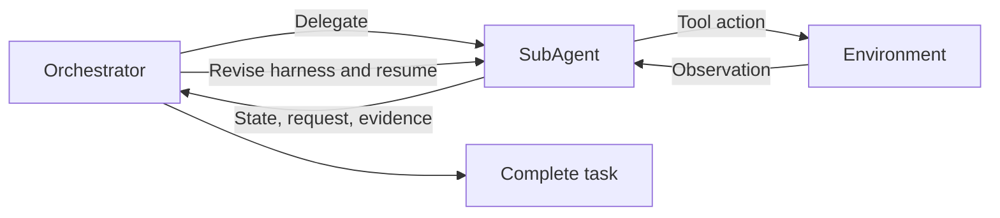

# Proactive Agentic Orchestration

**POrchestra** enables SubAgents to proactively request task and resource adjustments during execution. The orchestrator revises the active agent's harness while preserving its local history, allowing execution and adaptation to form one continuous workflow.

The paper also introduces **On-Policy Orchestration Distillation (OPOD)**, which turns execution-grounded feedback into process supervision for learning the orchestration policy.

[Anonymous code repository](https://anonymous.4open.science/r/POrchestra-23F3) · [GAIA2 setup](GAIA2.md)

## Overview

Existing re-orchestration methods typically wait for a SubAgent to finish or for a predefined trigger before adapting its configuration. POrchestra lets the executing SubAgent initiate communication whenever local observations reveal a need for adjustment.

Each SubAgent is configured with a subgoal, working context, tool set and execution budget. Its structured communication reports:

- **State:** progress, uncertainty and blockers.
- **Request:** the proposed task-scope or resource adjustment.
- **Evidence:** observations supporting the request.

The orchestrator can revise the active SubAgent, create a new SubAgent, terminate an execution path or complete the task. Applied revisions are recorded in the active agent's history so it can resume with its accumulated state. POrchestra uses one active SubAgent at a time.



### OPOD

OPOD combines feedback-guided distillation with outcome supervision:

1. Initialize the orchestrator through SFT on expert decisions.
2. Collect execution trajectories and attribute feedback to preceding delegation or revision decisions.
3. Convert attributable issues into natural-language improvement hints.
4. Sample actions from the current student and distill toward a frozen SFT teacher conditioned on the original context plus the hint, using full-vocabulary reverse KL.
5. Combine distillation with reward-weighted regression on decisions from successful trajectories.

The implemented objective described in Appendix E is `L_OPOD = L_RWR + λ L_OPD`, with `λ = 1` as the default. The attribution model is the frozen base Qwen3.5-9B; the student starts from its SFT checkpoint. SubAgent models remain fixed.

## Results

The following task success rates (%) are reported in the supplied manuscript's Table 1. All POrchestra inference comparisons use Gemini-3-Flash as the orchestrator; the rows specify the execution backbone.

| Execution backbone | GAIA | GAIA2 | SWE-bench Verified |
|---|---:|---:|---:|
| DeepSeek-V3.2 | 71.5 | 47.7 | 71.0 |
| Gemini-3-Flash | 78.2 | 53.9 | 77.0 |
| DeepSeek-V4-Flash | 77.6 | 55.5 | 79.0 |

The paper reports an average **9.1% relative improvement** over the strongest inference baseline. For Qwen3.5-9B orchestrators with DeepSeek-V4-Flash execution, Table 2 reports:

| POrchestra optimization | GAIA | GAIA2 |
|---|---:|---:|
| SFT | 72.4 | 43.8 |
| OPOD | **77.9** | **49.2** |
| Without RWR | 75.8 | 46.1 |
| Without OPD | 76.1 | 46.1 |

These are manuscript results, not measurements from the quick-start configurations below.

## Repository layout

```text
porchestra/                 # MainAgent, SubAgents, communication and revision
  gaia2_agent/              # GAIA2 agents, prompts and mechanism ablations
aorchestra/                # Shared orchestration utilities and baseline
base/                      # Agent, model and memory infrastructure
benchmark/                 # GAIA, GAIA2 and SWE-bench adapters
config/example/            # Model and benchmark configuration templates
integrations/              # ARE compatibility patch
bench_porchestra_gaia.py
bench_gaia2.py
bench_porchestra_swebench.py
sitecustomize.py            # ARE startup registration
```

## Installation

Run commands from the repository root. The GAIA/SWE-bench dependency file follows AOrchestra's Python 3.13 environment. Clean-environment dependency validation remains pending. GAIA2 uses the separate ARE environment described in [GAIA2.md](GAIA2.md).

```bash
python -m venv .venv
source .venv/bin/activate
pip install -r requirements.txt
cp .env.example .env
cp config/example/model_config.yaml config/model_config.yaml
mkdir -p config/benchmarks
cp config/example/benchmarks/*.yaml config/benchmarks/
```

Configure model endpoints and API keys through `.env` and `config/model_config.yaml`. GAIA web tools use `SERPER_API_KEY` and `JINA_API_KEY`. Multimodal tasks additionally require compatible image/audio models and relevant processing libraries. SWE-bench requires Docker and the official harness:

```bash
pip install -r requirements-swebench.txt
```

## Datasets

Download datasets separately under their respective access conditions.

| Benchmark | Paper evaluation | Setup |
|---|---|---|
| [GAIA](https://huggingface.co/datasets/gaia-benchmark/GAIA) | All 165 tasks in 2023 validation | Place `metadata.jsonl` and attachments under `benchmark/gaia/data/Gaia/2023/validation/` |
| [GAIA2](https://huggingface.co/datasets/meta-agents/gaia2) | 128 mini scenarios: 32 each for Execution, Search, Adaptability and Time | See [GAIA2.md](GAIA2.md); match the evaluation subset explicitly |
| [SWE-bench Verified](https://huggingface.co/datasets/princeton-nlp/SWE-bench_Verified) | A fixed subset of 100 issues | Configure `dataset_name`, `split` and the task-ID selection |

The GAIA2 evaluation and training pools are distinct: the paper uses the remaining 512 scenarios from the four categories for training. GAIA orchestrator training uses 2,339 TaskCraft tasks. Experiment subset manifests and training data are not bundled in this source snapshot.

## Running POrchestra

The example configurations use one task, concurrency one and `gpt-4o` to illustrate setup. Replace these with the paper's models and evaluation settings when reproducing experiments.

```bash
# GAIA
python bench_porchestra_gaia.py --config config/benchmarks/porchestra_gaia.yaml

# GAIA2: install the ARE environment first (GAIA2.md)
workspace/are-env/bin/python bench_gaia2.py --config config/benchmarks/porchestra_gaia2.yaml --dry-run
workspace/are-env/bin/python bench_gaia2.py --config config/benchmarks/porchestra_gaia2.yaml

# SWE-bench Verified
python bench_porchestra_swebench.py --config config/benchmarks/porchestra_swebench.yaml
```

Results and trajectories are written to `workspace/`. GAIA and SWE-bench accept `--tasks` and `--max_concurrency`; GAIA2 accepts `--limit` and `--concurrency`.

### Paper settings

| Setting | GAIA / GAIA2 | SWE-bench Verified |
|---|---|---|
| Inference orchestrator | Gemini-3-Flash | Gemini-3-Flash |
| Execution backbones | Gemini-3-Flash, DeepSeek-V3.2, DeepSeek-V4-Flash | Same |
| Total execution budget | 300 steps | 500 steps |
| Default SubAgent budget | 30 steps | 50 steps |

GAIA and GAIA2 allow creation of up to 10 SubAgents. API identifiers are `gemini-3-flash-preview`, `deepseek-v3.2` and `deepseek-v4-flash`; manuscript experiments use ChatAnywhere API access. Match the dataset IDs, prompt variants, judge configuration, budgets and model versions as well as the agent code. Quick-start commands alone do not reproduce the reported tables.

## Prompts

Prompt sources are retained from the local implementation:

- GAIA: `porchestra/prompts/main_agent.py` and `porchestra/subagent.py`.
- GAIA2: `porchestra/gaia2_agent/prompts.py` and its communication modules.
- SWE-bench: `porchestra/prompts/swebench_main_agent.py`, `swebench_subagent.py` and `swebench_mini_subagent.py`.

Appendix F presents the core templates with placeholders for long runtime inputs. Runtime configuration and environment switches can select different prompt variants; identical source files do not imply identical rendered prompts under different settings.

## Training

The paper uses full-parameter SFT for three epochs, followed by one epoch of OPOD with LoRA (rank 32, alpha 64, dropout 0.05). Both use a learning rate of `1e-5`, effective batch size 16 and a 32,768-token sequence setting. See Appendix E for sampling, loss normalization and evaluation details.

This source snapshot contains inference and benchmark integration. OPOD training code, data preparation, training configurations and checkpoints have not yet been packaged here; the reported training results are included above for reference.

## Acknowledgments and license

The implementation builds on [AOrchestra](https://github.com/FoundationAgents/AOrchestra), and GAIA2 uses [Meta Agents Research Environments](https://github.com/facebookresearch/meta-agents-research-environments). Source attribution and upstream licenses are preserved in [THIRD_PARTY.md](THIRD_PARTY.md) and `licenses/`.

The license for original POrchestra contributions remains to be selected. See `RELEASE_CHECKLIST.md` for outstanding publication and reproduction checks.
