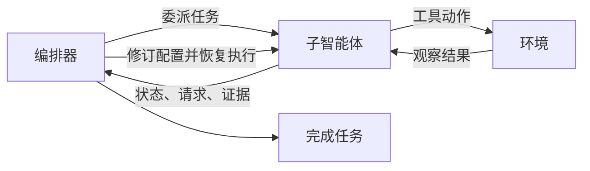

# 主动式智能体编排（Proactive Agentic Orchestration）

[English](README.md) | 简体中文

**POrchestra** 允许子智能体在执行过程中主动请求调整任务和资源。编排器保留当前子智能体的本地执行历史，并修订其执行配置（harness），使任务执行和动态适应形成连续的工作流程。

论文同时提出 **同策略编排蒸馏（On-Policy Orchestration Distillation，OPOD）**，将基于实际执行的反馈转化为过程监督，用于学习编排策略。

[匿名代码仓库](https://anonymous.4open.science/r/POrchestra-23F3) · [GAIA2 安装说明](GAIA2.md)

## 方法概览

现有的重新编排方法通常等待子智能体执行结束，或满足预定义的触发条件后，才调整配置。POrchestra 允许执行中的子智能体在本地观察表明需要调整时主动发起通信。

每个子智能体的配置包含子目标、工作上下文、工具集和执行预算。其结构化通信报告包含：

- **状态（State）：** 当前进展、不确定性和阻碍。
- **请求（Request）：** 建议的任务范围或资源调整。
- **证据（Evidence）：** 支持调整请求的实际观察。

编排器可以修订当前子智能体、创建新的子智能体、终止当前执行路径，或完成任务。已应用的修订会写入当前子智能体的历史，使其能够保留已有状态并继续执行。POrchestra 同一时间使用一个活跃子智能体。



### OPOD

OPOD 将反馈引导的蒸馏与结果监督结合：

1. 使用专家决策进行监督微调（SFT），初始化编排器。
2. 收集执行轨迹，将反馈归因到此前的委派或修订决策。
3. 将可归因的问题转化为自然语言改进提示。
4. 从当前学生模型采样动作，使用全词表反向 KL，向接收“原始上下文＋改进提示”的冻结 SFT 教师模型蒸馏。
5. 将蒸馏损失与成功轨迹决策上的奖励加权回归结合。

附录 E 描述的实现目标为 `L_OPOD = L_RWR + λ L_OPD`，默认 `λ = 1`。归因模型是冻结的 Qwen3.5-9B 基座模型；学生模型从 SFT 检查点初始化。子智能体模型保持固定。

## 实验结果

以下任务成功率（%）来自所提供论文的表 1。POrchestra 的推理对比均使用 Gemini-3-Flash 作为编排器，各行对应不同的执行模型。

| 执行模型 | GAIA | GAIA2 | SWE-bench Verified |
|---|---:|---:|---:|
| DeepSeek-V3.2 | 71.5 | 47.7 | 71.0 |
| Gemini-3-Flash | 78.2 | 53.9 | 77.0 |
| DeepSeek-V4-Flash | 77.6 | 55.5 | 79.0 |

论文报告，相对于最强推理基线，平均取得 **9.1% 的相对提升**。对于使用 Qwen3.5-9B 编排器、DeepSeek-V4-Flash 执行模型的设置，表 2 报告：

| POrchestra 优化方式 | GAIA | GAIA2 |
|---|---:|---:|
| SFT | 72.4 | 43.8 |
| OPOD | **77.9** | **49.2** |
| 移除 RWR | 75.8 | 46.1 |
| 移除 OPD | 76.1 | 46.1 |

这些是论文中的结果，并非下方快速开始配置的实测结果。

## 仓库结构

```text
porchestra/                 # 主智能体、子智能体、通信与修订
  gaia2_agent/              # GAIA2 智能体、提示词与机制消融
aorchestra/                # 共享编排工具与基线
base/                      # 智能体、模型和记忆基础设施
benchmark/                 # GAIA、GAIA2 和 SWE-bench 适配器
config/example/            # 模型及基准配置模板
integrations/              # ARE 兼容补丁
bench_porchestra_gaia.py
bench_gaia2.py
bench_porchestra_swebench.py
sitecustomize.py            # ARE 启动注册
```

## 安装

请在仓库根目录执行命令。GAIA/SWE-bench 依赖文件沿用 AOrchestra 的 Python 3.13 环境，全新环境的依赖验证尚未完成。GAIA2 使用独立的 ARE 环境，详见 [GAIA2.md](GAIA2.md)。

```bash
python -m venv .venv
source .venv/bin/activate
pip install -r requirements.txt
cp .env.example .env
cp config/example/model_config.yaml config/model_config.yaml
mkdir -p config/benchmarks
cp config/example/benchmarks/*.yaml config/benchmarks/
```

通过 `.env` 和 `config/model_config.yaml` 配置模型端点及 API 密钥。GAIA 网页工具使用 `SERPER_API_KEY` 和 `JINA_API_KEY`。多模态任务还需要兼容的图像／音频模型及相应处理库。SWE-bench 需要 Docker 和官方评测框架：

```bash
pip install -r requirements-swebench.txt
```

## 数据集

请遵守各数据集的访问条件，单独下载数据。

| 基准 | 论文评测范围 | 配置方法 |
|---|---|---|
| [GAIA](https://huggingface.co/datasets/gaia-benchmark/GAIA) | 2023 验证集全部 165 个任务 | 将 `metadata.jsonl` 和附件放入 `benchmark/gaia/data/Gaia/2023/validation/` |
| [GAIA2](https://huggingface.co/datasets/meta-agents/gaia2) | 128 个 mini 场景：Execution、Search、Adaptability、Time 各 32 个 | 参见 [GAIA2.md](GAIA2.md)，明确对齐评测子集 |
| [SWE-bench Verified](https://huggingface.co/datasets/princeton-nlp/SWE-bench_Verified) | 固定的 100 个问题子集 | 配置 `dataset_name`、`split` 及任务 ID 选择 |

GAIA2 的评测和训练数据相互独立：论文使用这四类中剩余的 512 个场景进行训练。GAIA 编排器训练使用 2,339 个 TaskCraft 任务。当前源码快照未附带实验子集清单和训练数据。

## 运行 POrchestra

示例配置使用单任务、并发数 1 和 `gpt-4o`，用于演示配置方式。复现实验时，请替换为论文中的模型和评测设置。

```bash
# GAIA
python bench_porchestra_gaia.py --config config/benchmarks/porchestra_gaia.yaml

# GAIA2：先安装 ARE 环境（参见 GAIA2.md）
workspace/are-env/bin/python bench_gaia2.py --config config/benchmarks/porchestra_gaia2.yaml --dry-run
workspace/are-env/bin/python bench_gaia2.py --config config/benchmarks/porchestra_gaia2.yaml

# SWE-bench Verified
python bench_porchestra_swebench.py --config config/benchmarks/porchestra_swebench.yaml
```

结果与执行轨迹写入 `workspace/`。GAIA 和 SWE-bench 支持 `--tasks` 和 `--max_concurrency`；GAIA2 支持 `--limit` 和 `--concurrency`。

### 论文设置

| 设置 | GAIA / GAIA2 | SWE-bench Verified |
|---|---|---|
| 推理编排器 | Gemini-3-Flash | Gemini-3-Flash |
| 执行模型 | Gemini-3-Flash、DeepSeek-V3.2、DeepSeek-V4-Flash | 同左 |
| 总执行预算 | 300 步 | 500 步 |
| 子智能体默认预算 | 30 步 | 50 步 |

GAIA 和 GAIA2 最多允许创建 10 个子智能体。API 模型标识为 `gemini-3-flash-preview`、`deepseek-v3.2` 和 `deepseek-v4-flash`；论文实验通过 ChatAnywhere API 访问模型。除智能体代码外，还需对齐数据集 ID、提示词版本、评判模型配置、预算和模型版本。仅运行快速开始命令不能复现论文表格。

## 提示词

提示词源码保留自本地实现：

- GAIA：`porchestra/prompts/main_agent.py` 和 `porchestra/subagent.py`。
- GAIA2：`porchestra/gaia2_agent/prompts.py` 及其通信模块。
- SWE-bench：`porchestra/prompts/swebench_main_agent.py`、`swebench_subagent.py` 和 `swebench_mini_subagent.py`。

附录 F 展示核心模板，并用占位符表示较长的运行时输入。运行配置和环境变量可以选择不同的提示词分支；源码文件相同，并不意味着不同设置下实际生成的提示词相同。

## 训练

论文先进行 3 个 epoch 的全参数 SFT，再使用 LoRA（rank 32、alpha 64、dropout 0.05）进行 1 个 epoch 的 OPOD 训练。两者的学习率均为 `1e-5`，有效 batch size 为 16，序列长度设置为 32,768 token。采样、损失归一化和评测细节见附录 E。

当前源码快照包含推理与基准集成。OPOD 训练代码、数据准备流程、训练配置和模型检查点尚未打包到本仓库；上方训练结果仅供参考。

## 致谢与许可证

本实现基于 [AOrchestra](https://github.com/FoundationAgents/AOrchestra)，GAIA2 使用 [Meta Agents Research Environments](https://github.com/facebookresearch/meta-agents-research-environments)。来源声明与上游许可证保存在 [THIRD_PARTY.md](THIRD_PARTY.md) 和 `licenses/` 中。

POrchestra 原创贡献的许可证尚待确定。待完成的发布和复现检查见 `RELEASE_CHECKLIST.md`。
